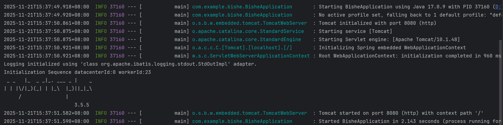
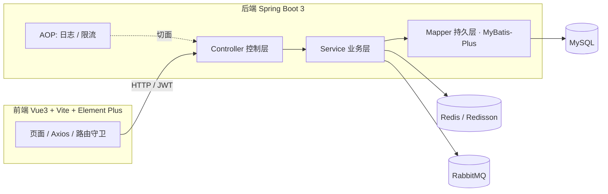
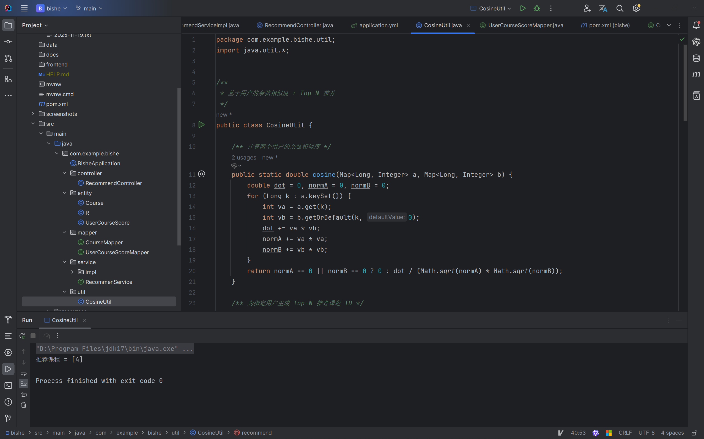
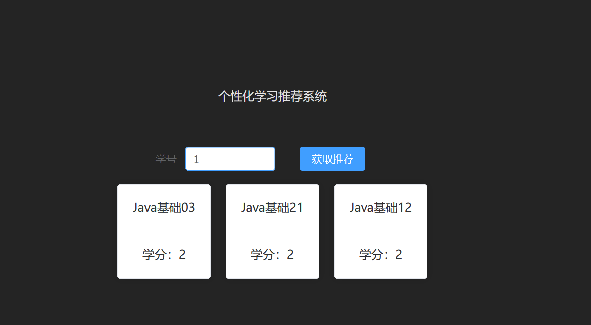

# 个性化学习推荐系统

基于 **Java + Spring Boot 3** 的个性化课程推荐系统，以**基于用户的协同过滤（User-Based CF）+ 余弦相似度**为核心算法，为学生提供"千人千面"的课程推荐，并覆盖课程管理、在线评分、角色权限等完整业务闭环。

- 后端：Java 17 + Spring Boot 3.2 + MyBatis-Plus + MySQL
- 前端：Vue 3 + Vite + Element Plus
- 中间件：Redis（缓存 / 限流）、RabbitMQ（异步解耦）、Redisson（分布式锁）
- 工程化：Knife4j 接口文档、JUnit 5 单元测试、JMeter 压测、AOP 日志与限流



---

## 一、功能特性

| 角色 | 功能 |
| --- | --- |
| 学生 | 注册 / 登录、浏览与搜索课程、查看课程详情、对课程 1–5 星评分、查看个性化推荐、我的学习与评分记录、修改密码 |
| 教师 | 发布课程、管理自己的课程（上下架）、查看选课学生 |
| 管理员 | 用户管理（启用 / 禁用、角色分配）、课程管理（查看、编辑、上下架）、平台数据看板 |

其他能力：

- **JWT 认证**：无状态登录，拦截器统一鉴权；密码使用 BCrypt 加密存储
- **个性化推荐**：评分不足 3 条时自动走热门课程冷启动兜底
- **Redis 缓存**：看板聚合数据 Cache-Aside 缓存，缓解数据库压力
- **接口限流**：基于自定义注解 + Lua 脚本实现按用户 / IP 的限流
- **操作日志**：AOP 切面异步记录关键操作
- **异步解耦**：RabbitMQ 处理推荐相关异步任务

---

## 二、系统架构



推荐主流程：

```text
收集用户评分 → 构建用户-课程评分矩阵 → 余弦相似度计算最近邻
→ 邻居评分加权平均（已学课程过滤）→ Top-N 推荐
→ 新用户 / 评分不足 → 热门课程兜底
```

---

## 三、项目结构

```text
bishe2025-backend/
├─ LICENSE             # MIT 许可证
├─ src/main/java/io/github/easynome/learnrecommend/
│  ├─ common/          # 统一返回 R、全局异常、注解、AOP 切面、常量
│  ├─ config/          # Redis / RabbitMQ / Redisson / CORS / Swagger / 拦截器配置
│  ├─ controller/      # 控制层：用户、课程、推荐、评分
│  ├─ dto / vo / entity# 数据传输对象、视图对象、数据库实体
│  ├─ interceptor/     # JWT 拦截器
│  ├─ mapper/          # MyBatis-Plus Mapper
│  ├─ service/         # 业务接口与实现（含 listener 异步监听）
│  └─ util/            # CosineUtil 推荐算法、JwtUtil、RedisUtil
├─ src/main/resources/
│  ├─ application.yml  # 配置（敏感项通过环境变量注入）
│  ├─ sql/             # 建表与演示数据脚本
│  └─ lua/limit.lua    # 限流脚本
├─ src/test/           # JUnit 单元测试、JMeter 压测脚本
├─ frontend/           # Vue 3 前端工程
├─ docs/               # 算法说明、用例图、接口截图、学习笔记
└─ screenshots/        # 开发与联调截图
```

---

## 四、快速开始

### 环境要求

- JDK 17、Maven 3.8+
- Node.js 18+（推荐 24）
- MySQL 8.0、Redis、RabbitMQ（本地默认连接，可用 Docker 启动）

### 1. 准备数据库

```sql
CREATE DATABASE learn_recommend DEFAULT CHARACTER SET utf8mb4;
```

建表与演示数据脚本位于 `src/main/resources/sql/`（`init_table.sql`、`insert_data.sql`，可用于灌入算法联调数据；完整字段以实体类为准）。

### 2. 启动后端

数据库等连接信息通过环境变量注入，默认值仅适用于本地 `root/root`：

```powershell
$env:DB_PASSWORD = "你的MySQL密码"     # 如与默认值不同
mvn spring-boot:run
```

后端地址：http://localhost:8080
接口文档（Knife4j）：http://localhost:8080/doc.html

### 3. 启动前端

```powershell
cd frontend
npm install
npm run dev
```

前端地址：http://localhost:5173 ，开发环境下 `/api` 自动代理到 `localhost:8080`。

> 注册的新用户默认为学生角色；教师 / 管理员角色可由管理员在用户管理中分配。

---

## 五、核心算法

采用**基于用户的协同过滤**：

1. 以用户对课程的评分构建评分向量；
2. 用余弦相似度找到与目标用户最相似的最近邻：

   ```text
   cos(u,v) = Σ(uᵢ·vᵢ) / (√Σuᵢ² · √Σvᵢ²)
   ```

3. 对邻居评过、而目标用户未学的课程做相似度加权平均，得到预测分并取 Top-N：

   ```text
   score(c) = Σ sim(u,v)·r(v,c) / Σ sim(u,v)
   ```

4. 新用户或评分不足时，返回热门课程兜底。

算法入口：`util/CosineUtil.java`、`service/impl/RecommendServiceImpl.java`；详细说明（含面试手写公式与示例）见 [docs/算法说明.md](docs/算法说明.md)。

---

## 六、测试

```powershell
mvn test          # 单元测试：CosineUtil 推荐算法、JwtUtil 令牌
```

JMeter 压测脚本（推荐接口锁与限流）位于 `src/test/jmeter/`，可在 `mvn verify` 阶段执行。



---

## 七、文档索引

- [算法说明](docs/算法说明.md)
- [项目上下文](docs/ai_context.md)
- [技术复盘笔记](docs/learning_note.md)
- [预留功能规划](docs/预留功能规划.md)
- 用例图：`docs/用例图/`
- 接口联调截图：`docs/*.png`

---

## 接口一览（节选）

| 方法 | 路径 | 说明 |
| --- | --- | --- |
| POST | `/api/login` | 登录，返回 JWT |
| POST | `/api/register` | 注册 |
| GET  | `/api/course/list` | 课程分页 / 搜索 |
| GET  | `/api/course/{id}` | 课程详情 |
| POST | `/api/course/{courseId}/rate` | 课程评分 |
| GET  | `/api/recommend?topN=5` | 个性化推荐 |
| POST | `/api/course/teacher/add` | 教师发布课程 |
| GET  | `/api/admin/users/list` | 管理员-用户列表 |
| GET  | `/api/course/data` | 首页看板数据 |



---

## 许可证与说明

- 本项目采用 [MIT 许可证](LICENSE)，Copyright (c) 2025 Eddie Wu
- 开发过程中部分代码借助 AI 辅助工具生成；系统架构设计、业务实现与调试由作者完成
